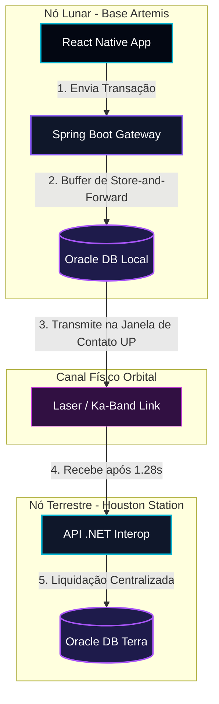

# ChronosDTN - Portal de Solução e Roteamento Financeiro Espacial (Terra-Lua)

> **Projeto Integrador - FIAP Global Solution**  
> **Tema:** Economia Espacial e Redes Tolerantes a Falhas/Atrasos (DTN)  
> **Status da Solução:** 100% Implementado, Conteinerizado e Homologado  

---

## 1. O que é o ChronosDTN?

O **ChronosDTN** é um ecossistema de infraestrutura de software projetado para funcionar como um **Gateway Financeiro** e **Roteador de Rede Tolerante a Falhas e Atrasos (DTN - Delay-Tolerant Networking)** para viabilizar transações financeiras comerciais entre colônias na Lua (ex: Polo Sul / Base Artemis) e centrais bancárias na Terra (ex: Houston Ground Station).

A solução resolve os três principais desafios da física e da infraestrutura aeroespacial no espaço profundo:
1. **Alta Latência**: O tempo de propagação do sinal de rádio de ida e volta (RTT) entre a Terra e a Lua é de aproximadamente 2.56 segundos na velocidade da luz.
2. **Interrupções de Link**: Ocultações orbitais e rotação dos corpos celestes causam perdas frequentes de linha de visada direta.
3. **Erros de Transmissão**: A radiação cósmica e a atenuação atmosférica corrompem pacotes.

O ChronosDTN implementa a especificação de arquitetura **Store-and-Forward** do **Bundle Protocol (RFC 5050 / RFC 9171)** para garantir que transações financeiras sejam acumuladas em buffers locais seguros e transmitidas somente quando enlaces de rádio Ka-Band ou comunicação laser estiverem ativos.

---

## 2. Mapa do Repositório e Módulos

O ecossistema está segmentado em 6 módulos integrados. Cada módulo possui sua própria documentação detalhada (`README.md` local):

```
chronos_dtn/
├── database/                    # [Fase 1] Banco de Dados Relacional Oracle
│   ├── schema.sql               # Estrutura física das 6 tabelas (DDL)
│   ├── data.sql                 # Carga de 80 registros reais para teste (DML)
│   ├── plsql.sql                # 6 Blocos procedurais de roteamento, juros e conciliação
│   └── README.md                # Documentação técnica do BD e modelagem NoSQL JSON
├── backend_java/                # [Fase 2] API Core de Liquidação Financeira
│   ├── src/                     # Código Spring Boot 3.x com JPA, JWT e Swagger
│   ├── Dockerfile               # Compilação e execução segura em imagem Alpine non-root
│   └── README.md                # Instruções de execução e endpoints REST/HATEOAS
├── backend_net/                 # [Fase 3] API de Interoperabilidade C#
│   ├── src/                     # Código Web API em .NET 8/10 com EF Core
│   └── README.md                # Roteiro de testes de conformidade HAL JSON
├── frontend_mobile/             # [Fase 4] App Console do Operador (NCC)
│   ├── src/                     # Telas móveis desenvolvidas em React Native + Expo
│   └── README.md                # Guia de emulação e design system deep space
├── infra/                       # [Fase 5] Orquestração Docker e Infraestrutura
│   ├── init_db/                 # Scripts SQL/Bash de boot automatizado do banco
│   └── README.md                # Comandos operacionais de infraestrutura
├── governance/                  # [Fase 6] Governança Corporativa e Compliance
│   ├── ARCHITECTURE_TOGAF.md    # Documento de Arquitetura de Referência TOGAF v10
│   └── README.md                # Guia de conformidade regulatória e qualidade
└── docker-compose.yml           # Arquivo macro de inicialização integrada local
```

---

## 3. Arquitetura Conceitual da Rede



---

## 4. Guia Rápido de Execução

### Pré-requisitos
*   [Docker Desktop](https://www.docker.com/products/docker-desktop/) instalado e rodando.
*   Portas `8080` (Java API) e `1521` (Oracle DB) liberadas na sua máquina host.

### Passos para Inicializar a Pilha Completa

1.  **Clonar ou navegar até o diretório raiz do projeto**:
    ```bash
    cd C:\Users\maico\.gemini\antigravity\scratch\chronos_dtn
    ```

2.  **Subir a infraestrutura via Docker Compose**:
    ```bash
    docker compose up -d --build
    ```
    *Este comando compilará a API Spring Boot em ambiente multi-stage e iniciará a imagem do Oracle Database 23ai Free.*

3.  **Acompanhar a inicialização do Banco e Carga de Scripts**:
    ```bash
    docker compose logs -f chronos-db
    ```
    *O banco executará automaticamente os scripts de criação do usuário `CHRONOS` e a injeção do schema relacional, mocks de dados e rotinas PL/SQL procedurais.*

4.  **Acessar a documentação dos Endpoints REST**:
    *   Assim que a API Java reportar inicialização de sucesso, acesse a interface Swagger/OpenAPI interativa:
        *   `http://localhost:8080/swagger-ui/index.html`

5.  **Executar o Aplicativo Móvel (Desenvolvimento)**:
    *   Navegue até a pasta do aplicativo móvel:
        ```bash
        cd frontend_mobile
        ```
    *   Instale as dependências locais:
        ```bash
        npm install
        ```
    *   Inicie o servidor Expo no modo Web:
        ```bash
        npm run web
        ```

---

## 5. Padrões de Segurança e Compliance Técnico

*   **Autenticação**: Stateless por meio de tokens JWT assinados com algoritmo HMAC256.
*   **Integridade do Payload**: Assinatura digital assimétrica e checksum SHA-256 do payload transacional contra ruídos físicos na transmissão de dados.
*   **Arquitetura Corporativa**: Alinhado com as fases A, B, C e D do framework **TOGAF v10** e modelado na notação **ArchiMate**.
*   **Tratamento de Erros**: Respostas de falha de negócio padronizadas com a **RFC 7807 (Problem Details)** em todas as APIs.
