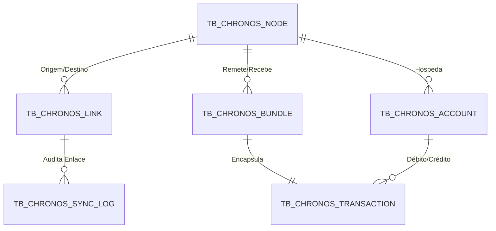

# ChronosDTN - Arquitetura de Banco de Dados Relacional e NoSQL

Este repositório contém a infraestrutura de dados central do **ChronosDTN**, o Gateway Financeiro e Roteador de Rede Tolerante a Falhas entre a Terra e a Lua. O sistema foi projetado para atuar no ambiente hostil do espaço profundo, onde a latência de rádio (mínimo de ~1.28s por percurso para a Lua) e a intermitência dos links orbitais exigem um design resiliente.

---

## 1. Decisões Arquiteturais e Modelagem Híbrida

O ChronosDTN adota uma **arquitetura híbrida de dados**:

1. **SQL Relacional (Oracle/Postgres)**: Utilizado como repositório central de reconciliação de contas, garantindo transações bancárias com propriedades **ACID** (Atomicidade, Consistência, Isolamento e Durabilidade) perfeitas. Isso impede problemas graves como gasto duplo (double spending) ou saldos fantasma.
2. **NoSQL Documental (JSON)**: Utilizado no buffer rápido local de armazenamento e envio (Store-and-Forward) de cada gateway de rede (nó). Como a escrita rádio em disco precisa ser veloz, o gateway serializa a transação como um documento JSON fechado (Bundle) que aguarda a janela de contato rádio e, posteriormente, é reconciliado nas tabelas relacionais corporativas da rede central.

### Diagrama de Classes e Entidades (Mermaid)

---

## 2. Dicionário de Dados Resumido

*   `TB_CHRONOS_NODE`: Cadastro físico das estações de rádio em solo terrestre e lunar (ex: Houston, Artemis Base).
*   `TB_CHRONOS_LINK`: Planejamento de janelas de contato orbital (Contact Plan). Define a largura de banda, latência esperada de rádio e quando o link estará ativo (`UP`).
*   `TB_CHRONOS_ACCOUNT`: Registro financeiro de saldos corporativos terrestres (USD) e lunares (LUN - Lunar Credits).
*   `TB_CHRONOS_BUNDLE`: Fila persistente Store-and-Forward (Protocolo DTN RFC 9171). Contém metadados de tráfego espacial, o payload e a prioridade de envio.
*   `TB_CHRONOS_TRANSACTION`: Registro financeiro das transferências ocorridas dentro dos bundles, ligando contas com status pendente, liquidada ou rejeitada.
*   `TB_CHRONOS_SYNC_LOG`: Log de reconciliação periódica pós-fechamento do link de comunicação rádio.

---

## 3. Guia de Execução dos Scripts

Para rodar a estrutura localmente ou em ambiente corporativo Oracle Database, siga a ordem estrita de dependências dos scripts:

1.  **[schema.sql](file:///C:/Users/maico/.gemini/antigravity/scratch/chronos_dtn/database/schema.sql)**: Cria todas as tabelas, chaves primárias, estrangeiras, restrições de validação (`CHECK`) e índices otimizadores para buscas rápidas.
2.  **[data.sql](file:///C:/Users/maico/.gemini/antigravity/scratch/chronos_dtn/database/data.sql)**: Popula a base com 86 registros mocks altamente consistentes simulando o tráfego espacial em uma janela histórica de 30 dias.
3.  **[plsql.sql](file:///C:/Users/maico/.gemini/antigravity/scratch/chronos_dtn/database/plsql.sql)**: Cria e executa as rotinas de roteamento espacial, liquidação diferida com controle de saldo, auditoria de falhas de rádio, expurgo de TTLs vencidos e taxas cambiais automáticas.
4.  **[queries.sql](file:///C:/Users/maico/.gemini/antigravity/scratch/chronos_dtn/database/queries.sql)**: Roda os 5 relatórios consolidados de auditoria com JOINs, subconsultas e funções agregadoras.

---

## 4. Defesa de Banca Acadêmica: Respostas e Justificativas

> [!NOTE]
> Esta seção foi projetada sob medida para blindar o projeto acadêmico contra questionamentos difíceis dos avaliadores.

### Pergunta 1: "Por que escolheram uma modelagem relacional híbrida com NoSQL em vez de usar apenas NoSQL de ponta a ponta no Gateway?"
*   **Justificativa de Arquitetura**: 
    Operações financeiras não aceitam consistência eventual no nível de liquidação. Se utilizássemos apenas bancos NoSQL distribuídos puros, estaríamos sujeitos ao teorema CAP: sacrificando consistência em prol de partição. 
    Nossa arquitetura usa o NoSQL de forma tática como um buffer temporário rápido para enfileirar bundles de transporte (store-and-forward) no rádio, enquanto o banco relacional Oracle na Terra e na Lua gerencia o estado consolidado das contas financeiras com transações ACID rígidas. Isso previne duplicidades cambiais e garante auditabilidade contábil impecável.

### Pergunta 2: "Como o ecossistema de banco de dados trata a latência física orbital e a perda constante de sinal rádio?"
*   **Justificativa de Arquitetura**: 
    A modelagem prevê a tabela `TB_CHRONOS_BUNDLE` (filas de trânsito) e a tabela `TB_CHRONOS_LINK` (Contact Plan). As transações entram em estado `PENDING` e o respectivo bundle em `BUFFERED`. 
    Através da lógica PL/SQL programada, as transações só são promovidas a `SETTLED` (Liquidadas) quando o bundle que as carrega é entregue no nó destino (`DELIVERED`) e a rotina de reconciliação de links confirma a integridade dos dados. Se a janela de contato fechar e o pacote estourar o tempo máximo de vida (`DT_EXPIRY` / TTL), a lógica PL/SQL de expurgamento marca o bundle como `EXPIRED` e desfaz a transação financeira atualizando seu estado para `REJECTED`, estornando os créditos reservados de forma segura.

### Pergunta 3: "Para que servem os campos `TX_HASH` e `TX_PAYLOAD` na tabela de Bundles?"
*   **Justificativa de Segurança**:
    O espaço profundo está sujeito a altos níveis de radiação ionizante e ruído cósmico que provocam bit flips (inversão de bits físicos) nas memórias flash e transmissões eletromagnéticas. 
    O `TX_HASH` guarda um hash SHA-256 gerado no momento do envio do payload financeiro. Quando o nó de destino recebe o bundle, ele calcula o hash novamente. Se os hashes não baterem, o pacote está corrompido fisicamente e é descartado pelo roteador, forçando a retransmissão de forma automatizada via PL/SQL. O payload imutável também armazena assinaturas digitais do remetente, prevenindo contra ataques cibernéticos de spoofing ou injeção de ordens financeiras falsas na Lua.
