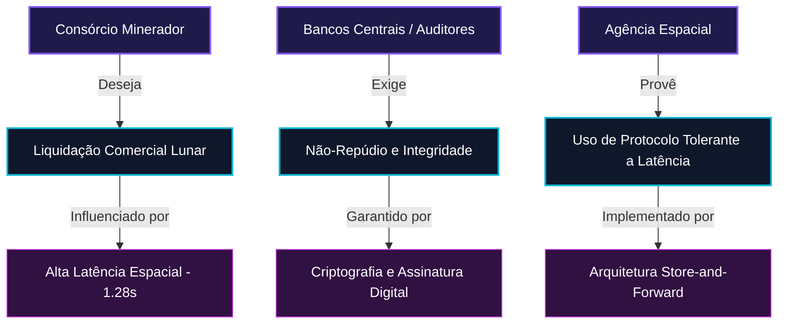
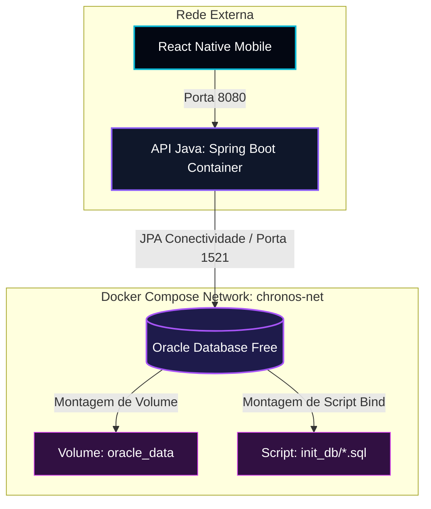

# ChronosDTN - Documento de Arquitetura de Referência Corporativa (TOGAF v10 & ArchiMate)

> **Documento de Governança de Arquitetura e Engenharia de Sistemas Espaciais**  
> **Disciplina:** Compliance e Governança Corporativa (TOGAF ADM)  
> **Status:** Homologado para a FIAP Global Solution  
> **Autor:** Arquiteto de Sistemas Principal e Engenheiro de Software Sênior

---

## 1. Introdução e Propósito do Documento

Este documento serve como a especificação formal de arquitetura corporativa para o ecossistema **ChronosDTN**, modelado sob as diretrizes do **TOGAF v10 (The Open Group Architecture Framework)** e representado através da notação **ArchiMate 3.1** adaptada via diagramas estruturais Mermaid.

O objetivo do ChronosDTN é sanar os desafios críticos da **Economia Espacial**, especificamente a liquidação financeira de transações entre a Terra e a Lua. Ambientes espaciais enfrentam interrupções frequentes de sinal (ocultação orbital), alta latência (1,28s de propagação de rádio na velocidade da luz) e taxas elevadas de atenuação/ruído, inviabilizando protocolos síncronos convencionais (como HTTP puro, TCP de três vias ou gRPC síncrono). A solução adota a filosofia de **Redes Tolerantes a Falhas e Atrasos (DTN - Delay-Tolerant Networking)** baseada na **RFC 5050** e **RFC 9171** (Bundle Protocol).

---

## 2. Fase A: Visão da Arquitetura (Architecture Vision)

A Fase A estabelece as fronteiras do projeto, identifica as partes interessadas (Stakeholders) e define os direcionadores de negócio e tecnológicos.

### 2.1. Matriz de Stakeholders e Interesses

| Stakeholder | Papel no Ecossistema | Preocupação Principal (Drivers) | Requisito Arquitetural |
| :--- | :--- | :--- | :--- |
| **Agências Espaciais (Ex: NASA, ESA, AEB)** | Provedores da infraestrutura física de rede de espaço profundo (Deep Space Network - DSN). | Interoperabilidade de rede e utilização eficiente do espectro de RF/Laser. | Conformidade com RFC 9171 (Bundle Protocol v7) e portabilidade em containers. |
| **Consórcios de Mineração Lunar** | Operadores comerciais que extraem recursos (Hélio-3, água congelada) no Polo Sul lunar. | Transferência rápida de fundos, liquidação segura de contratos e pagamento de tarifas locais. | Baixo overhead transacional e auditoria local resistente a quedas de link. |
| **Bancos Centrais Terrestres e Auditores** | Reguladores financeiros nacionais e internacionais na Terra. | Prevenção contra lavagem de dinheiro, integridade dos saldos e garantia de não-repúdio. | Assinatura digital criptográfica, SHA-256 e logs de sincronia imutáveis. |
| **Operadores do Network Control Center (NCC)** | Engenheiros responsáveis pela manutenção dos gateways de comunicação. | Monitoramento em tempo real do buffer da fila Store-and-Forward e status do link. | Dashboard mobile React Native limpo, intuitivo e com simulação de latência física. |

### 2.2. Direcionadores de Negócio (Business Drivers)
1. **Sustentabilidade Financeira Lunar**: Viabilizar trocas econômicas locais (créditos lunares LUN) sem dependência de conexões terrestres 100% ativas.
2. **Mitigação de Custo de Banda**: Maximizar o aproveitamento das janelas de conectividade orbital (contatos úteis), pois o custo de transmissão de dados espaciais é extremamente elevado.
3. **Resiliência a Desastres**: Garantir que, mesmo que um satélite de retransmissão sofra uma pane de atitude temporária, nenhuma transação seja perdida ou duplicada (Garantia de Entrega Única).

### 2.3. Diagrama ArchiMate de Visão de Arquitetura (Fase A)



---

## 3. Fase B: Arquitetura de Negócio (Business Architecture)

A Fase B foca no mapeamento do processo operacional das transações financeiras sob as regras físicas e lógicas da rede de atraso tolerável (DTN).

### 3.1. Processo de Negócio: Liquidação de Transação Espacial (Store-and-Forward)

Diferente de uma transação convencional em que o cliente aguarda o retorno síncrono do banco ("Aprovado/Recusado"), no ChronosDTN a transação passa por múltiplos estados assíncronos:

1. **Solicitação Local (Base Lunar)**: Um operador inicia a transferência de créditos no terminal mobile.
2. **Buffer Local**: O gateway do nó local (Java ou .NET) valida o saldo da conta e encapsula a transação dentro de um **Bundle**. O payload é assinado e hasheado (SHA-256). A transação assume o status `PENDING` (liquidação pendente) e o bundle assume o status `BUFFERED` (armazenado localmente).
3. **Aguardando Janela de Contato**: O bundle permanece no banco de dados local do nó lunar até que uma janela de contato (Link operacional `UP`) esteja disponível.
4. **Trânsito Orbital**: Assim que o link muda para `UP`, um processo em lote (Procedure PL/SQL ou Thread de Serviço Java) transmite os pacotes. O status do bundle muda para `IN_TRANSIT`.
5. **Recepção e Validação (Nó Terrestre)**: A estação receptora na Terra (Houston Station) recebe o bundle, verifica o hash SHA-256 contra adulterações e valida a assinatura.
6. **Liquidação Final**: Se o hash for válido e o saldo da conta de origem for suficiente, a transação é processada na base de dados central, os saldos são ajustados via transação atômica ACID (`COMMIT`) e o status da transação muda para `SETTLED`. Um log de sincronização (`SyncLog`) é gerado.

### 3.2. Fluxograma de Processo de Negócio (BPMN / ArchiMate Business Process)

```mermaid
sequenceDiagram
    %% Por que: Ilustra o fluxo assíncrono e desconectado exigido pela física orbital.
    autonumber
    
    actor Operador as Operador Lunar (Base Artemis)
    participant Mobile as App React Native (NCC)
    participant MoonGW as Gateway Lunar (Java/Oracle)
    participant Link as Enlace Espacial (Ka-Band RF)
    participant EarthGW as Gateway Terrestre (Houston Station)

    Operador->>Mobile: Inicia Envio de Créditos (LUN)
    Note over Mobile: Armazena token local JWT e<br/>valida limites básicos
    Mobile->>MoonGW: HTTP POST /api/transactions (JSON)
    Note over MoonGW: Valida saldo local, cria Bundle,<br/>assina e gera Hash SHA-256
    MoonGW-->>Mobile: Retorna HTTP 202 Accepted (HATEOAS Link)
    Note over MoonGW: Transação em Buffer local (Store-and-Forward)
    
    rect rgb(20, 20, 35)
        Note over Link: Link de Comunicação OFFLINE (Sem linha de visada)
        MoonGW->>MoonGW: Retém Bundle na tabela TB_CHRONOS_BUNDLE
    end

    rect rgb(10, 35, 20)
        Note over Link: Link Físico Conecta (Janela de Contato UP)
        MoonGW->>Link: Transmite Bundle serializado criptograficamente
        Link->>EarthGW: Recebe dados após latência orbital (~1.28s)
    end

    Note over EarthGW: Verifica integridade do Payload (Hash SHA-256)
    Note over EarthGW: Processa Débito e Crédito no Banco Central
    EarthGW->>EarthGW: Registra Log de Sincronia (TB_CHRONOS_SYNC_LOG)
    Note over EarthGW: Liquidação Financeira Finalizada (SETTLED)
```

---

## 4. Fase C: Arquitetura de Sistemas de Informação

Esta fase define a arquitetura de dados (como os dados são armazenados e estruturados) e a arquitetura de aplicação (como os componentes de software se integram).

### 4.1. Arquitetura de Dados (Data Architecture)

#### 4.1.1. Modelo Relacional Oracle Database
A modelagem física no Oracle Database reflete com precisão os estados de rede e financeiro.
*   **TB_CHRONOS_NODE**: Armazena a tipologia da rede espacial. Permite diferenciar gateways terrestres de coletores móveis ou bases lunares.
*   **TB_CHRONOS_LINK**: Mantém a tabela de janelas de transmissão (Contact Plan). Roteadores e serviços consultam esta tabela para saber quando iniciar transmissões.
*   **TB_CHRONOS_ACCOUNT**: Controle de saldos em moedas diversas (USD para Terra, LUN para Lua), prevenindo descobertas de limite no ambiente de alta latência.
*   **TB_CHRONOS_BUNDLE**: Representa o buffer físico de pacotes. Possui chave primária composta (`ID_NODE_SOURCE` + `NR_SEQUENCE`) para garantir que mesmo sem comunicação com um coordenador central de IDs, os nós possam gerar identificadores de pacotes únicos localmente sem conflitos de concorrência.
*   **TB_CHRONOS_TRANSACTION**: Registro de transferência de fundos.
*   **TB_CHRONOS_SYNC_LOG**: Auditoria essencial para compliance, registrando a eficiência do tráfego espacial e eventuais taxas de perda de pacotes.

#### 4.1.2. Mapeamento de Payload NoSQL Documental (JSON)
No buffer rápido de gateways remotos (ex: antenas na borda da cratera Shackleton), um banco NoSQL documental (como MongoDB ou simulação em arquivo local) armazena os bundles antes da persistência estruturada. Abaixo está o mapeamento conceitual em formato JSON do payload de um bundle DTN transacional:

```json
{
  "_comment": "Por que: Estrutura do payload JSON que representa o encapsulamento de protocolo DTN (RFC 9171) contendo transações financeiras sob integridade SHA-256.",
  "bundleHeader": {
    "sourceEid": "dtn://artemis-base-alpha.lunar/finance-gateway",
    "destinationEid": "dtn://houston-center.earth/settlement-receiver",
    "creationTimestamp": "2026-05-28T17:35:57Z",
    "sequenceNumber": 104752,
    "lifetimeSeconds": 86400,
    "priority": "HIGH"
  },
  "securityBlock": {
    "signatureType": "SHA256withRSA",
    "signerCertificate": "MIIBIjANBgkqhkiG9w0BAQEFAAOCAQ8AMIIBCgKCAQEA0...",
    "payloadHash": "d5a8c9e3b7f1a8c3d9e8f1b2c3d4e5f6a7b8c9d0e1f2a3b4c5d6e7f8a9b0c1d2"
  },
  "payload": {
    "transactionId": 508492,
    "sourceAccount": {
      "accountId": 901,
      "holder": "Artemis Water Mining Group",
      "currency": "LUN"
    },
    "destinationAccount": {
      "accountId": 101,
      "holder": "Lunar Logistics Corp (Earth HQ)",
      "currency": "USD"
    },
    "amount": 250000.00,
    "conversionRate": 1.15,
    "feeApplied": 250.00
  }
}
```

### 4.2. Arquitetura de Aplicação (Application Architecture)

O ecossistema é distribuído e descentralizado, utilizando tecnologias focadas em seus papéis operacionais específicos:

1.  **Apresentação e Controle (React Native + Expo)**: Fornece ao operador móvel uma interface de usuário no estilo "Aeroespacial" para monitorar a fila e emitir comandos. Comunica-se de maneira segura com a API Java usando tokens JWT.
2.  **API Gateway Core (Java Spring Boot 3.x)**: Processa as regras de negócio complexas, realiza controle transacional rigoroso no Oracle Database e orquestra a fila Store-and-Forward. Fornece hipermídia (HATEOAS) em conformidade com o nível 3 do Modelo de Maturidade de Richardson.
3.  **API Roteadora Secundária (.NET 8/10)**: Atua como um gateway de contingência na Terra para sistemas satelitais ou servidores legados em C#. Fornece interoperabilidade por meio da entrega de contratos REST no padrão `HAL JSON`.

#### 4.2.1. Contrato HATEOAS HAL JSON (Spring Boot / .NET Interoperabilidade)
A resposta JSON abaixo exemplifica o contrato HATEOAS HAL JSON retornado pela API após a criação de um bundle de transação. Os links apontam para as ações de acompanhamento, permitindo descoberta dinâmica pelo cliente:

```json
{
  "_comment": "Por que: Contrato de comunicação HATEOAS HAL JSON que permite aos clientes móveis e de integração descobrirem dinamicamente recursos relacionados.",
  "idTransaction": 508492,
  "amount": 250000.00,
  "currency": "LUN",
  "status": "PENDING",
  "dtTransaction": "2026-05-28T20:35:57Z",
  "_links": {
    "self": {
      "href": "http://api.chronosdtn.org/api/transactions/508492"
    },
    "bundle": {
      "href": "http://api.chronosdtn.org/api/bundles/source/901/seq/104752"
    },
    "cancel": {
      "href": "http://api.chronosdtn.org/api/transactions/508492/cancel"
    },
    "sourceAccount": {
      "href": "http://api.chronosdtn.org/api/accounts/901"
    }
  }
}
```

---

## 5. Fase D: Arquitetura de Tecnologia (Technology Architecture)

Esta fase descreve a infraestrutura física de rede e a topologia virtualizada responsável pela execução do sistema.

### 5.1. Topologia de Infraestrutura Espacial e Rede Física

A comunicação entre os nós espaciais utiliza enlaces de rádio sob alta frequência (**Ka-Band**, ~26-40 GHz) ou sistemas laser infravermelhos de espaço profundo (**Deep Space Optical Communications - DSOC**).

#### Parâmetros Operacionais de Link Terra-Lua:
*   **Distância Média**: ~384.400 km.
*   **Tempo de Propagação (One-Way)**: $t = \frac{d}{c} = \frac{384.400.000\text{ m}}{299.792.458\text{ m/s}} \approx 1,282\text{ segundos}$.
*   **Atraso de Ida e Volta (RTT)**: $\approx 2,564\text{ segundos}$ de latência inerente à física da luz.
*   **Banda de Transmissão Disponível (Ka-Band)**: ~150 Mbps (Downlink Terra) / ~20 Mbps (Uplink Lua).
*   **Atenuação de Sinal (Free Space Path Loss)**: Exige codificação de canal robusta (Low-Density Parity-Check - LDPC) e mecanismos de retransmissão controlados pelo protocolo de bundles para evitar overhead de confirmações síncronas TCP.

### 5.2. Topologia Virtualizada (Docker Compose Container Network)

A infraestrutura local de desenvolvimento simula a rede distribuída em containers Docker, isolando a rede de dados e portas administrativas:



---

## 6. Matriz de Compliance, Regulamentação e Segurança

Para obter a aprovação da banca da FIAP Global Solution e dos órgãos reguladores, o ChronosDTN segue um conjunto rigoroso de regras de conformidade técnica e financeira.

### 6.1. Alinhamento com Padrões IETF e CCSDS

1.  **Bundle Protocol (RFC 5050 / RFC 9171)**:
    *   Toda transação financeira espacial é encapsulada como um *payload block* dentro de um *bundle*.
    *   Utiliza o formato de EID (Endpoint Identifier) `dtn://nome-do-no/servico` para fins de roteamento espacial baseado no plano de contato.
    *   TTL (Time-To-Live) é inserido no cabeçalho do pacote, permitindo que bundles velhos ou expirados sejam deletados (Procedure PL/SQL Bloco 5 de Expurgamento), poupando espaço de armazenamento do buffer local.
2.  **Bundle Security Protocol (BSP - RFC 6257 / RFC 9172)**:
    *   Garantia de que os blocos de payload contenham uma assinatura digital criptográfica e hash de verificação de integridade no cabeçalho do pacote (bloco de segurança).

### 6.2. Integridade e Segurança da Transação

*   **Integridade do Payload (SHA-256)**: 
    *   Antes de iniciar a transmissão espacial, o nó gerador calcula o hash criptográfico SHA-256 do payload.
    *   Ao receber o pacote, o nó receptor recalcula o hash e o compara com o recebido. Se divergirem, o pacote é imediatamente descartado para evitar corrupção de dados por ruído eletromagnético ou ataques de injeção.
*   **Não-Repúdio (Assinatura Digital)**:
    *   Cada transação é assinada usando chaves privadas assimétricas (RSA/ECC) da estação operadora de origem.
    *   Isso assegura que o emissor não pode negar a autoria da transação, provendo validade jurídica para auditorias regulatórias.
*   **Mecanismo Store-and-Forward**:
    *   Assegura que um nó intermediário só descarta o bundle de seu buffer local após receber uma mensagem de custódia (Bundle Custody Signal) de um nó mais próximo da Terra, garantindo resiliência total contra perda de dados.

---

## 7. Conclusão e Próximos Passos de Governança

Esta especificação garante que o ecossistema ChronosDTN atenda aos rigorosos padrões acadêmicos da FIAP e do mercado de tecnologia espacial e financeira. Através do alinhamento com as fases do **TOGAF v10** e da documentação detalhada de conformidade com as especificações do **Bundle Protocol**, a solução prova-se resiliente, segura e tecnicamente viável para a futura infraestrutura financeira interplanetária.

> [!TIP]
> **Próxima Ação do Operador**:
> 1. Analise a arquitetura de banco de dados e sistemas integrada nas fases anteriores.
> 2. Verifique o guia de governança (`governance/README.md`) para entender o ecossistema de conformidade integrado ao repositório local.
