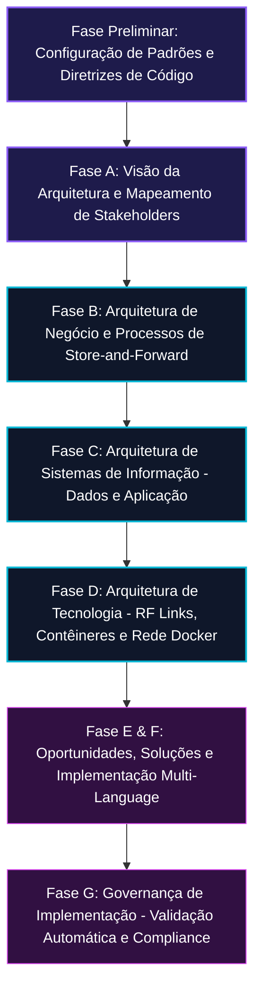

# ChronosDTN - Governança de Arquitetura e Engenharia de Software Espacial

> **Guia de Governança Corporativa e Conformidade para a FIAP Global Solution**  
> **Framework de Referência:** TOGAF v10 ADM (Architecture Development Method)  
> **Objetivo:** Estabelecer diretrizes operacionais, conformidades técnicas e rastreabilidade da solução ChronosDTN.

---

## 1. Visão Geral da Governança

O desenvolvimento de sistemas de suporte à vida econômica extraterrestre — como o gateway financeiro e roteador espacial **ChronosDTN** — exige um nível de controle de qualidade e padronização muito superior aos sistemas de informação terrestres. Pequenos erros em protocolos de rede ou inconsistências no banco de dados podem resultar na perda definitiva de transações financeiras críticas sob enlaces espaciais instáveis.

Por essa razão, adotamos o **TOGAF v10 ADM (Architecture Development Method)** como base conceitual para guiar todas as decisões de design de software e infraestrutura do projeto, garantindo que os objetivos de negócio dos consórcios mineradores lunares e a segurança transacional exigida pelos órgãos reguladores terrestres sejam atingidos de ponta a ponta.

---

## 2. A Estrutura do Ciclo ADM no ChronosDTN

O ciclo ADM do TOGAF foi percorrido de forma incremental pelas fases de desenvolvimento deste projeto:

### Detalhamento das Fases Aplicadas no Projeto:

1. **Fase Preliminar**: Definição da stack tecnológica (Java Spring Boot, .NET 8/10, React Native, Oracle PL/SQL, Docker) e do escopo do ecossistema ChronosDTN.
2. **Fase A (Visão de Arquitetura)**: Mapeamento de agentes reguladores, mineradores e agências aeroespaciais no documento [ARCHITECTURE_TOGAF.md](file:///C:/Users/maico/.gemini/antigravity/scratch/chronos_dtn/governance/ARCHITECTURE_TOGAF.md).
3. **Fase B (Arquitetura de Negócio)**: Mapeamento de fluxos transacionais tolerantes a falhas no espaço profundo, mudando o paradigma de conexões HTTP diretas para buffers de pacotes de store-and-forward.
4. **Fase C (Arquitetura de Sistemas de Informação)**:
   * **Arquitetura de Dados**: Implementação física do banco de dados relacional Oracle (tabelas de sincronia, bundles e transações) e estruturação do payload documental NoSQL (JSON).
   * **Arquitetura de Aplicação**: Design do front-end mobile React Native, API corporativa Java (com autenticação JWT segura e HATEOAS) e API secundária C# em .NET para interoperabilidade.
5. **Fase D (Arquitetura de Tecnologia)**: Dimensionamento dos enlaces físicos orbitais (frequência Ka-band e atenuação laser) e encapsulamento em contêineres Docker interconectados.
6. **Fase G (Governança da Implementação)**: Scripts de validação (`verify_api.ps1`), planos de teste integrados e documentação do roteiro de execução em contêiner.

---

## 3. Estrutura do Diretório de Governança

Esta pasta de governança centraliza toda a especificação de arquitetura e compliance do ecossistema:

*   **[ARCHITECTURE_TOGAF.md](file:///C:/Users/maico/.gemini/antigravity/scratch/chronos_dtn/governance/ARCHITECTURE_TOGAF.md)**: O documento principal detalhando as fases de arquitetura corporativa do TOGAF v10, diagramas ArchiMate conceituais e a matriz de compliance com a RFC 9171 (Bundle Protocol v7).
*   **[README.md](file:///C:/Users/maico/.gemini/antigravity/scratch/chronos_dtn/governance/README.md)**: Este guia explicativo.

---

## 4. Diretrizes de Qualidade e Compliance Técnico

Para garantir a evolução contínua da arquitetura, novos desenvolvedores e arquitetos que atuarem no projeto ChronosDTN devem respeitar os seguintes princípios de engenharia de software sênior:

1.  **Integridade de Dados Acima de Tudo (Princípio do Store-and-Forward)**:
    *   Nenhuma operação financeira deve depender de conexões diretas.
    *   Toda chamada de rede que cruza o ambiente espacial deve ser persistida localmente (banco relacional ou NoSQL documental) antes da transmissão física.
2.  **Segurança e Validação Criptográfica Rigorosa**:
    *   Não se processa nenhum pacote financeiro sem a verificação de hash SHA-256 e validação de assinatura digital de nó autorizado.
    *   Controle de acesso por API deve usar JWT com escopos e roles limitadas (`ROLE_OPERATOR`).
3.  **Princípio da Interoperabilidade**:
    *   Qualquer microserviço adicionado ao ecossistema deve expor contratos HATEOAS (`HAL JSON`) para permitir a descoberta dinâmica de recursos.
    *   Devem ser fornecidas implementações em ecossistemas distintos (ex: Java e .NET) para comprovar a viabilidade técnica multiplataforma dos canais de roteamento espacial.
4.  **Auto-Suficiência da Documentação (Código Autodocumentado)**:
    *   Cada linha de arquivo de configuração ou código fonte precisa ter comentários didáticos explicando o **porquê** de sua implementação, facilitando o onboarding de desenvolvedores juniores e a auditoria de segurança regulatória.

---

> [!IMPORTANT]
> **Acesso Rápido**:
> Para consultar a especificação formal completa de cada fase e as matrizes de conformidade, leia o arquivo [ARCHITECTURE_TOGAF.md](file:///C:/Users/maico/.gemini/antigravity/scratch/chronos_dtn/governance/ARCHITECTURE_TOGAF.md).
