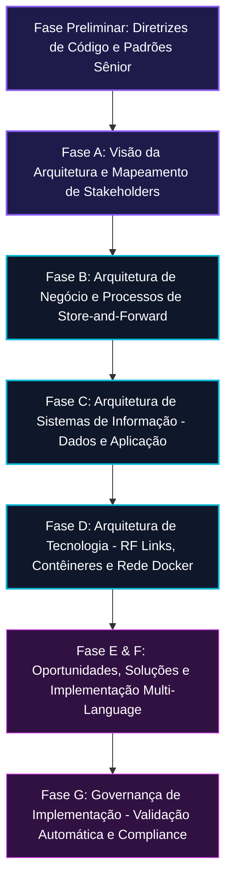

# 🏛️ Guia de Governança e Compliance Corporativo - ChronosDTN

> **Manual de Governança Corporativa e Conformidade para a FIAP Global Solution.**  
> Descreve as regras de qualidade, conformidade com o IETF Bundle Protocol, e a aplicação das fases ADM do TOGAF v10.

---

## 🚀 1. O Papel da Governança no Espaço Profundo

Sistemas bancários terrestres tradicionais dependem de comunicação permanente de baixa latência. No entanto, em um ambiente de economia espacial (ligando a Terra e a Lua), erros de processamento e inconsistências em transações de rádio-link podem resultar na perda definitiva de fundos e ativos corporativos.

Por essa razão, adotamos o método **TOGAF v10 ADM (Architecture Development Method)** para direcionar todas as fases de construção do projeto, garantindo conformidade com padrões aeroespaciais (IETF/CCSDS) e regulamentações financeiras de segurança.

---

## 📁 2. A Estrutura do Ciclo ADM no ChronosDTN

O ciclo ADM do TOGAF foi percorrido de forma incremental ao longo do desenvolvimento deste ecossistema:

### Detalhamento das Fases Aplicadas no Projeto:

1.  **Fase Preliminar**: Configuração do ambiente de desenvolvimento multiplataforma (Java, .NET, React Native) e adoção de práticas de comentários didáticos detalhados em todos os arquivos.
2.  **Fase A (Visão de Arquitetura)**: Mapeamento de partes interessadas (Stakeholders) como agências espaciais, consórcios de mineração lunar, e auditores financeiros terrestres no documento principal de arquitetura.
3.  **Fase B (Arquitetura de Negócio)**: Mapeamento de processos e transações assíncronas do modelo Store-and-Forward, eliminando dependências de respostas HTTP síncronas entre os corpos celestes.
4.  **Fase C (Arquitetura de Sistemas de Informação)**:
    *   *Dados*: Modelagem física das tabelas do Oracle DB (saldos, bundles e logs) e definição de payloads NoSQL JSON para enfileiramento de rádio.
    *   *Aplicação*: Relação e responsabilidade de cada microserviço (Java REST API com HATEOAS, .NET Interoperabilidade com HAL JSON, e App Mobile Expo Router).
5.  **Fase D (Arquitetura de Tecnologia)**: Dimensionamento dos enlaces físicos (Ka-Band e Laser), latências espaciais (1.28 segundos de propagação) e orquestração virtualizada por Docker Compose.
6.  **Fase G (Governança da Implementação)**: Scripts automatizados de teste local, validações estáticas de tipos TypeScript (`npx tsc --noEmit`) e checagens de saúde em contêineres.

---

## 📜 3. Documentos do Diretório de Governança

*   **[ARCHITECTURE_TOGAF.md](file:///C:/Users/maico/.gemini/antigravity/scratch/chronos_dtn/governance/ARCHITECTURE_TOGAF.md)**: Especificação formal da arquitetura corporativa do ChronosDTN, com diagramas estruturais ArchiMate (Mermaid) e a matriz de compliance com a RFC 9171 (Bundle Protocol v7).
*   **[README.md](file:///C:/Users/maico/.gemini/antigravity/scratch/chronos_dtn/governance/README.md)**: Este guia.

---

## 🔒 4. Diretrizes de Qualidade e Compliance Técnico

Para garantir a integridade da arquitetura, toda e qualquer alteração de código no ChronosDTN deve respeitar as seguintes premissas:

1.  **Garantia de Não-Duplicidade**: Transações espaciais remotas devem nascer em estado `PENDING` e os créditos associados devem ser retidos temporariamente na origem para mitigar o double spending no espaço profundo.
2.  **Verificação Criptográfica**: Nenhum pacote (Bundle) financeiro deve ser liquidado no destino sem antes passar pela validação de integridade do checksum SHA-256 e assinatura digital de operador autorizado.
3.  **Autoexplicabilidade (Regra Sênior)**: Toda linha de configuração de infraestrutura ou código de negócio deve possuir comentários didáticos explicando o **porquê** de sua existência, facilitando a auditabilidade de segurança e o onboarding do time.
